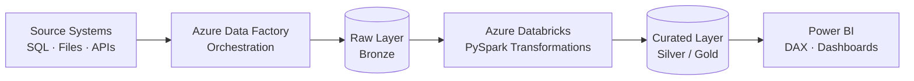

---

## 👋 About Me

I’m working as an Analyst at **KPMG India**, working in **Banking & Capital Markets**. I turn complex financial data into clear, decision-ready insights, and I'm scaling that work into cloud data engineering on **Azure**.

- 📊 **BI & Analytics:** Enterprise Power BI dashboards, DAX modelling, SQL-driven reporting
- ☁️ **Data Engineering:** Pipelines and transformations with Azure Data Factory, Azure Databricks, PySpark
- 🔄 **Automation:** Alteryx workflows and Python scripting to cut manual effort
- 🎯 **Building toward:** Cloud-scale data platforms, end to end, from ingestion to insight

---

## 🛠️ Tech Stack

**Cloud & Data Platform (Azure)**

**Big Data & Processing**

**Databases**

**Business Intelligence**

**Languages & DevOps**

---

## 🏗️ How I Think About Data Pipelines

---

## 🎓 Certifications

---

## 🚀 Featured Projects

<!-- EDIT: replace with your real projects. Keep descriptions to one line with an impact statement. -->

| Project | What it does | Stack |
|---|---|---|
| 🔹 **[Azure Banking Datalake Pipeline]([https://github.com/lavanshi295/REPO-NAME](https://github.com/lavanshi295/Azure-Banking-Datalake-pipeline))** | End-to-end Azure Data Engineering pipeline for banking analytics using ADF, Databricks, ADLS Gen2, Synapse Analytics and Power BI | Azure Databricks · PySpark · ADF |
| 🔹 **[Azure CRM Repository](https://github.com/lavanshi295/REPO-NAME)** | One-line impact statement | Power BI · DAX · SQL |

---

## 📈 GitHub Stats

---

## 🤝 Let's Connect

<!-- EDIT: add your real links -->

*Open to conversations on data engineering, BI, and Azure.*

